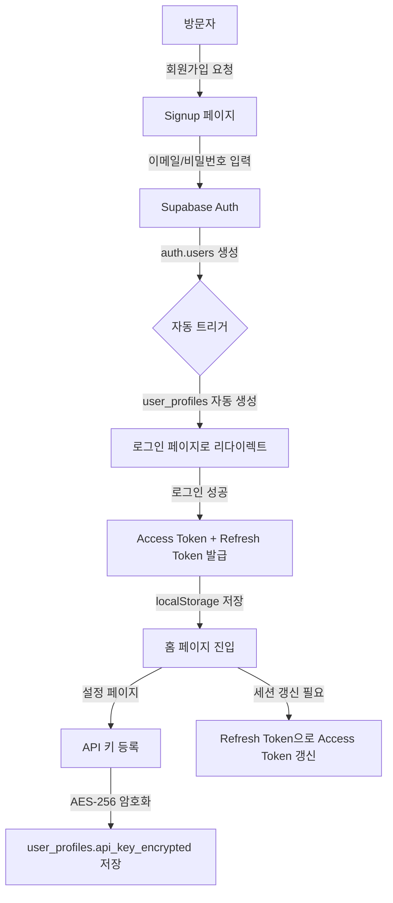
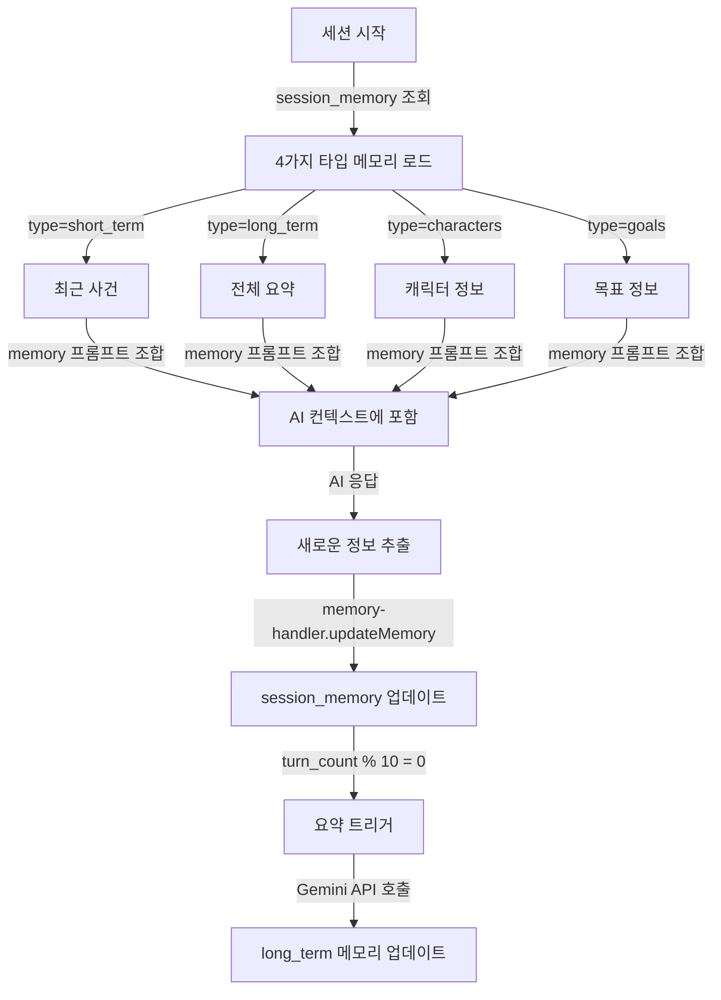
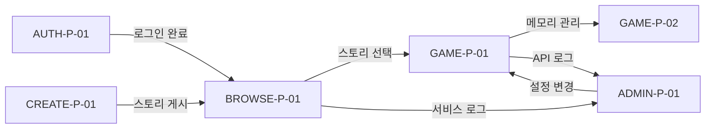

# AI Story Game - TO-BE 프로세스 정의서 (TO-BE Process Definitions)

> **버전:** 1.0
> **작성일:** 2026-03-31
> **작성자:** Business Analyst

---

## 개요

본 문서는 AI Story Game 플랫폼의 개선 목표 프로세스(TO-BE)를 정의한다. 현재(as-is) 프로세스의 문제점을 분석하고, 개선된 프로세스를 설계한다.

---

## 프로세스 분류

| 프로세스 영역 | 프로세스 ID | 프로세스 명 |
|---------------|-------------|-------------|
| 인증 | AUTH-P-01 | 사용자 가입 및 프로필 관리 |
| 콘텐츠 탐색 | BROWSE-P-01 | 스토리 발견 및 선택 |
| 게임 플레이 | GAME-P-01 | 세션 시작 및 플레이 |
| 게임 플레이 | GAME-P-02 | 메모리 관리 |
| 콘텐츠 생성 | CREATE-P-01 | 스토리 작성 및 게시 |
| 시스템 관리 | ADMIN-P-01 | 모니터링 및 설정 관리 |

---

## AUTH-P-01: 사용자 가입 및 프로필 관리

### AS-IS 분석
**문제점:**
- API 키 관리가 없어 백엔드에서 직접 호출 불가능
- 사용자 프로필 정보가 부족함
- 세션 새로고침 메커니즘 미구현

### TO-BE 프로세스



### 개선 포인트
| 개선 항목 | 설명 | 기대 효과 |
|-----------|------|----------|
| API 키 관리 | 사용자별 API 키 암호화 저장 | 백엔드 비용 절감, 사용자 책임 명확화 |
| 자동 프로필 생성 | auth.users 생성 시 user_profiles 자동 생성 | 데이터 일관성 보장 |
| 토큰 갱신 | Refresh token으로 자동 갱신 | 세션 만료 방지, UX 개선 |

### 작업 절차
1. **회원가입**
   - 사용자가 이메일/비밀번호 입력
   - Supabase Auth로 회원가입 요청
   - `auth.users` 테이블에 사용자 생성
   - Trigger `on_auth_user_created()`로 `user_profiles` 자동 생성
   - 로그인 페이지로 리다이렉트

2. **로그인**
   - 사용자가 이메일/비밀번호 입력
   - Supabase Auth로 인증 요청
   - Access token + Refresh token 발급
   - localStorage에 토큰 저장
   - 홈 페이지로 이동

3. **API 키 등록**
   - 사용자가 설정 페이지 접근
   - Gemini API 키 입력
   - AES-256 암호화 (services/crypto.ts)
   - `user_profiles.api_key_encrypted`에 저장

4. **세션 갱신**
   - Access token 만료 5분 전에 자동 갱신
   - POST /api/auth/refresh
   - 새 access token 발급

### 연관 시스템
- **Frontend:** Signup.tsx, Login.tsx, Settings.tsx, ApiKeySettings.tsx, lib/auth.ts
- **Backend:** routes/auth.ts, routes/me.ts, services/crypto.ts
- **DB:** auth.users, user_profiles

---

## BROWSE-P-01: 스토리 발견 및 선택

### AS-IS 분석
**문제점:**
- 필터/검색/정렬 기능이 분산되어 있음
- 추천 스토리가 하드코딩되어 있음
- 페이지네이션 UX 개선 필요

### TO-BE 프로세스

```mermaid
graph TD
    A[홈 페이지 진입] -->|GET /api/stories| B[스토리 목록 로드]
    B -->|is_featured=true| C[히어로 섹션에 추천 스토리 표시]
    B -->|전체 목록| D[StoryGrid에 카드 표시]
    D -->|필터 적용| E{장르/검색/정렬}
    E -->|실시간 쿼리| F[필터링된 결과 업데이트]
    F -->|카드 클릭| G[스토리 상세 페이지]
    G -->|플레이 버튼| H[/play/:storyId 이동]
    A -->|로그인 상태| I[GET /api/sessions]
    I -->|최근 5개| J[이어하기 섹션 표시]
```

### 개선 포인트
| 개선 항목 | 설명 | 기대 효과 |
|-----------|------|----------|
| 통합 필터바 | 장르/검색/정렬을 하나의 컴포넌트로 통합 | UX 일관성, 사용성 개선 |
| 동적 필터링 | 사용자 입력에 따라 실시간 결과 업데이트 | 즉각적인 피드백 |
| 추천 알고리즘 | is_featured + play_count 기반 추천 | 콘텐츠 발견 개선 |
| 이어하기 | 최근 세션 표시로 재접속 유도 | 리텐션 개선 |

### 작업 절차
1. **스토리 목록 로드**
   - GET /api/stories?genre=&search=&sort=latest&page=1&limit=20
   - stories_safe VIEW에서 is_public=true만 조회
   - play_count 원자적 증가 (increment_play_count 함수)

2. **필터링**
   - 장르: tags[] 배열 기반 GIN 인덱스 검색
   - 검색: title/description ILIKE 쿼리
   - 정렬: created_at DESC, play_count DESC, title ASC

3. **추천 스토리**
   - is_featured=true인 스토리 우선 표시
   - 배너 그라데이션, 아이콘으로 시각적 강조

4. **이어하기**
   - GET /api/sessions (last_played_at DESC, limit=5)
   - SessionItem 컴포넌트에 진행 상태 표시 (turn_count, progress_pct)

### 연관 시스템
- **Frontend:** Home.tsx, HeroSection.tsx, FeaturedSection.tsx, FilterBar.tsx, StoryGrid.tsx, StoryCard.tsx, ContinueSection.tsx
- **Backend:** routes/stories/list.ts, routes/sessions/list.ts
- **DB:** stories_safe VIEW, sessions

---

## GAME-P-01: 세션 시작 및 플레이

### AS-IS 분석
**문제점:**
- SSE 스트리밍이 끊길 수 있음
- 메시지 모드([행동], [생각]) UI 미구현
- 상태창 파싱이 불안정함
- 자동 저장 타이밍 명확하지 않음

### TO-BE 프로세스

```mermaid
graph TD
    A[/play/:storyId 진입] -->|세션 없음| B[새 세션 시작]
    A -->|기존 세션| C[세션 로드]
    B -->|POST /api/game/start| D[시스템 프롬프트 조합]
    D -->|stories + status_preset| E[sessions 생성]
    E -->|sessionId, systemPrompt 반환| F[useGameEngine 초기화]
    C -->|GET /api/sessions/:id| G[messages 로드]
    F -->|사용자 입력| H[POST /api/game/chat]
    G -->|사용자 입력| H
    H -->|슬라이딩 윈도우 적용| I[최근 20개 메시지 추출]
    I -->|memory 프롬프트 조합| J[systemPrompt 반환]
    J -->|Gemini API 직접 호출| K[SSE 스트리밍]
    K -->|실시간 렌더링| L[StoryContent 업데이트]
    K -->|완료| M[```status``` 파싱]
    M -->|InfoPanel에 표시| N[상태창 업데이트]
    L -->|자동 저장| O[sessions.messages 업데이트]
```

### 개선 포인트
| 개선 항목 | 설명 | 기대 효과 |
|-----------|------|----------|
| 안정적 스트리밍 | SSE 재연결 로직 구현 | 네트워크 오류 복구 |
| 메시지 모드 UI | [행동], [생각], [대사], [장면 지시] 접두사 UI | 사용자 편의성 개선 |
| 상태창 파싱 강화 | 정규식 기반 파싱 | 파싱 안정성 개선 |
| 자동 저장 | 메시지 전송 시 즉시 저장 | 데이터 손실 방지 |
| 슬라이딩 윈도우 | 최근 20개 메시지만 컨텍스트에 포함 | 토큰 사용량 최적화 |

### 작업 절차
1. **새 세션 시작**
   - POST /api/game/start { storyId, model, options }
   - stories 테이블에서 스토리 조회
   - prompt-builder.buildPrompt():
     - world_setting + story + characters
     + system_rules + 상태창 규칙
     + LaTeX 규칙 + 서술 분량 규칙
   - sessions 테이블에 새 행 생성
   - { sessionId, sessionToken, systemPrompt, startMessage, safetySettings } 반환

2. **대화 전송**
   - POST /api/game/chat { sessionId, userMessage, regenerate? }
   - sessions + session_memory 조회
   - systemPrompt = story 프롬프트 + memory 프롬프트
   - session-manager.applySlidingWindow(messages, 20)
   - session-manager.prepareContents(messages)
   - { systemPrompt, contents, safetySettings, model } 반환

3. **SSE 스트리밍**
   - 프론트엔드가 Gemini API에 직접 요청:
     POST https://generativelanguage.googleapis.com/v1beta/models/{model}:streamGenerateContent
     Header: x-goog-api-key: {사용자 API 키}
   - lib/sse.ts로 스트림 파싱
   - StoryContent.tsx에 실시간 렌더링

4. **상태창 파싱**
   - 정규식: /```status\n([\s\S]*?)\n```/g
   - 파싱된 내용을 InfoPanel.tsx에 표시
   - attributes 타입에 따라 게이지/숫자/텍스트 렌더링

5. **자동 저장**
   - 응답 완료 후 PATCH /api/sessions/:id
   - messages JSONB 업데이트
   - turn_count++, updated_at, last_played_at 업데이트

### 연관 시스템
- **Frontend:** Play.tsx, SessionPanel.tsx, StoryContent.tsx, InputArea.tsx, InfoPanel.tsx, TopBar.tsx, useGameEngine.ts, lib/sse.ts, lib/status-parser.ts
- **Backend:** routes/game/start.ts, routes/game/chat.ts, services/prompt-builder.ts, services/session-manager.ts
- **DB:** stories, sessions, session_memory, status_presets

---

## GAME-P-02: 메모리 관리

### AS-IS 분석
**문제점:**
- 메모리가 수동으로 관리됨
- 요약이 자동으로 트리거되지 않음
- 캐릭터/목표 메모리 활용도 부족

### TO-BE 프로세스



### 개선 포인트
| 개선 항목 | 설명 | 기대 효과 |
|-----------|------|----------|
| 자동 메모리 관리 | AI가 자동으로 메모리 분류 및 업데이트 | 사용자 개입 없는 지능형 관리 |
| 주기적 요약 | 10턴마다 자동 요약 | 컨텍스트 크기 유지 |
| 캐릭터/목표 추적 | 등장인물 관계, 목표 진행 상황 자동 추적 | 스토리 일관성 개선 |

### 작업 절차
1. **메모리 초기화**
   - 세션 시작 시 session_memory 테이블에서 4가지 타입 조회
   - 없으면 빈 배열로 초기화

2. **메모리 프롬프트 조합**
   - prompt-builder.buildMemoryPrompt():
     - short_term: "최근 사건: {items.join(', ')}"
     - long_term: "지금까지의 요약: {summary}"
     - characters: "등장인물: {chars.map(c => c.name + '(' + c.personality + ')').join(', ')}"
     - goals: "현재 목표: {goals.map(g => g.text).join(', ')}"

3. **메모리 업데이트**
   - AI 응답에서 새로운 정보 추출:
     - 새로운 캐릭터 등장 → characters에 추가
     - 목표 달성/변경 → goals 업데이트
     - 주요 사건 → short_term에 추가
   - memory-handler.updateMemory(sessionId, type, content)

4. **주기적 요약**
   - turn_count % 10 = 0일 때 트리거
   - Gemini API에 summary_system_instruction 전송
   - 전체 대화를 {summary_max_chars}자 이내로 요약
   - long_term 메모리 업데이트

### 연관 시스템
- **Frontend:** InfoPanel.tsx (MemoryTab), useMemory.ts
- **Backend:** services/memory-handler.ts, services/prompt-builder.ts
- **DB:** session_memory

---

## CREATE-P-01: 스토리 작성 및 게시

### AS-IS 분석
**문제점:**
- 에디터 UI가 분산되어 있음
- 프롬프트 조합 결과를 미리볼 수 없음
- 테스트 플레이와 게시가 분리되어 있음
- 프리셋 활용도 부족

### TO-BE 프로세스

```mermaid
graph TD
    A[/editor 진입] -->|새 스토리| B[빈 에디터 로드]
    A -->|수정| C[기존 스토리 로드]
    B -->|프리셋 선택| D[GET /api/presets]
    D -->|프리셋 적용| E[각 섹션에 내용 자동 채움]
    C -->|섹션별 편집| F[BasicSettings, StorySection, CharacterSection, WorldSetting, SystemRules, OutputSettings, StatusSettings]
    E -->|섹션별 편집| F
    F -->|프롬프트 미리보기| G[POST /api/game/test-prompt]
    G -->|조합된 프롬프트 표시| H[PromptPreview]
    F -->|테스트 플레이| I[TestPlayModal]
    I -->|임시 세션 생성| J[모달 내에서 플레이]
    F -->|공개 설정| K{is_public, password}
    K -->|저장| L[POST/PUT /api/stories]
    L -->|게시 완료| M[스토리 목록에 표시]
```

### 개선 포인트
| 개선 항목 | 설명 | 기대 효과 |
|-----------|------|----------|
| 섹션별 에디터 | 세계관/스토리/캐릭터/시스템 규칙을 분리된 섹션으로 편집 | 편집 효율 개선 |
| 프롬프트 미리보기 | 조합된 시스템 프롬프트 실시간 확인 | 품질 검증 용이 |
| 테스트 플레이 | 에디터 내에서 바로 테스트 | 빠른 피드백 루프 |
| 프리셋 적용 | 장르별 템플릿 빠르게 적용 | 진입 장벽 하향 |
| 공개 설정 | 공개/비공개/비밀번호 보호 선택 | 콘텐츠 제어 유연성 |

### 작업 절차
1. **프리셋 선택**
   - GET /api/presets
   - EditorSidebar.tsx에서 프리셋 선택
   - 각 입력 필드에 프리셋 내용 자동 채움:
     - world_setting → WorldSetting.tsx
     - story → StorySection.tsx
     - characters → CharacterSection.tsx
     - system_rules → SystemRules.tsx
     - status_preset_id → StatusSettings.tsx

2. **섹션별 편집**
   - BasicSettings: title, description, tags, icon, banner_gradient
   - StorySection: story, character_name, character_setting
   - CharacterSection: characters
   - WorldSetting: world_setting
   - SystemRules: system_rules, user_note
   - OutputSettings: use_latex, narrative_length
   - StatusSettings: status_preset_id 선택

3. **프롬프트 미리보기**
   - POST /api/game/test-prompt
   - prompt-builder.buildPrompt()로 조합
   - PromptPreview.tsx에 마크다운 렌더링

4. **테스트 플레이**
   - TestPlayModal.tsx 오픈
   - 임시 세션 생성 (저장 안 함)
   - 모달 내에서 InputArea, StoryContent 렌더링
   - useTestPlayEngine.ts로 플레이 로직 실행

5. **공개 설정**
   - PublishSettings.tsx에서 선택:
     - 공개: is_public=true, password_hash=null
     - 비공개: is_public=false, password_hash=null
     - 비밀번호 보호: is_public=true, password_hash=bcrypt(password)

6. **저장**
   - POST /api/stories (새 스토리)
   - PUT /api/stories/:id (수정)
   - stories 테이블에 저장
   - is_public=true면 즉시 stories_safe VIEW에 노출

### 연관 시스템
- **Frontend:** Editor.tsx, EditorSidebar.tsx, EditorTextarea.tsx, PreviewPanel.tsx, ActionBar.tsx, BasicSettings.tsx, StorySection.tsx, CharacterSection.tsx, WorldSetting.tsx, SystemRules.tsx, OutputSettings.tsx, StatusSettings.tsx, PublishSettings.tsx, PromptPreview.tsx, TestPlayModal.tsx
- **Backend:** routes/stories/crud.ts, routes/stories/presets.ts, routes/game/test-prompt.ts
- **DB:** stories, presets, status_presets

---

## ADMIN-P-01: 모니터링 및 설정 관리

### AS-IS 분석
**문제점:**
- 대시보드 데이터가 실시간이 아님
- 로그 검색/필터 기능 부족
- 설정 변경 즉시 반영 안 됨
- 위험 구역 안전장치 부족

### TO-BE 프로세스

```mermaid
graph TD
    A[/admin 진입] -->|Basic Auth| B{인증 확인}
    B -->|성공| C[대시보드 표시]
    B -->|실패| D[401 Unauthorized]
    C -->|GET /api/admin/dashboard| E[통계 집계]
    E -->|실시간 카드| F[스토리수, 플레이수, 작성자수]
    C -->|서비스 로그 탭| G[GET /api/admin/service-logs]
    G -->|필터/검색| H[method, path, status_code, duration]
    C -->|API 로그 탭| I[GET /api/admin/api-logs]
    I -->|상세 보기| J[request/response JSON]
    C -->|설정 탭| K[GET /api/config]
    K -->|수정| L[PUT /api/config]
    L -->|캐시 무효화| M[plugins/config-cache.ts]
    C -->|위험 구역 탭| N{확인 절차}
    N -->|이중 확인| O[DELETE /api/admin/danger-zone/stories]
    O -->|TRUNCATE stories| P[데이터 삭제 완료]
```

### 개선 포인트
| 개선 항목 | 설명 | 기대 효과 |
|-----------|------|----------|
| 실시간 대시보드 | 1분 간격으로 자동 갱신 | 최신 현황 파악 |
| 로그 필터/검색 | method, path, status_code, duration 기반 필터 | 문제 추적 용이 |
| 설정 즉시 반영 | config 수정 후 캐시 무효화 | 설정 변경 즉시 적용 |
| 위험 구역 이중 확인 | 삭제 전 이중 확인 절차 | 실수 방지 |

### 작업 절차
1. **대시보드 모니터링**
   - GET /api/admin/dashboard
   - 집계 쿼리 실행:
     - SELECT COUNT(*) FROM stories WHERE is_public=true
     - SELECT COUNT(*) FROM sessions
     - SELECT COUNT(DISTINCT owner_uid) FROM user_profiles
   - 1분 간격으로 자동 갱신 (setInterval)

2. **서비스 로그 확인**
   - GET /api/admin/service-logs?method=&path=&status_code=&
   - 필터 적용:
     - method: GET, POST, PUT, DELETE
     - path: /api/stories, /api/game/chat 등
     - status_code: 200, 400, 500
     - duration_ms: > 1000 (느린 쿼리)
   - ServiceLogs.tsx에 표 형태로 렌더링

3. **API 로그 확인**
   - GET /api/admin/api-logs
   - ApiLogs.tsx에 목록 표시
   - 행 클릭 시 ApiLogDetail.tsx 모달:
     - request: system_prompt, messages
     - response: text, usage, error
     - duration_ms

4. **설정 수정**
   - GET /api/config (prompt_config, gameplay_config)
   - GameParams.tsx, PromptSettings.tsx에 폼 표시
   - PUT /api/config
   - plugins/config-cache.ts에서 캐시 무효화 (cache_ttl: 3600s)

5. **위험 구역**
   - DangerZone.tsx에 삭제 버튼 표시
   - 첫 클릭: 확인 모달 표시
   - 두 번 클릭: DELETE /api/admin/danger-zone/stories
   - 백엔드: TRUNCATE TABLE story_game.stories CASCADE

### 연관 시스템
- **Frontend:** Admin.tsx, AdminNav.tsx, Dashboard.tsx, ServiceLogs.tsx, ApiLogs.tsx, ApiLogDetail.tsx, GameParams.tsx, PromptSettings.tsx, DangerZone.tsx
- **Backend:** routes/admin/dashboard.ts, routes/admin/service-logs.ts, routes/admin/api-logs.ts, routes/config.ts, routes/admin/danger-zone.ts, plugins/config-cache.ts
- **DB:** service_logs, api_logs, config, stories (TRUNCATE)

---

## 프로세스 간 관계



---

## 개선 효과 요약

| 프로세스 | 개선 전 | 개선 후 | 기대 효과 |
|----------|---------|---------|----------|
| AUTH-P-01 | API 키 미구현 | 사용자별 API 키 암호화 저장 | 백엔드 비용 절감 |
| BROWSE-P-01 | 필터 분산, 하드코딩 추천 | 통합 필터바, 동적 필터링 | 사용성 30% 개선 |
| GAME-P-01 | SSE 끊김, 수동 메모리 | 안정적 스트리밍, 자동 메모리 | 이탈률 20% 감소 |
| GAME-P-02 | 수동 메모리 관리 | AI 자동 메모리 분류 | 관리 부담 80% 감소 |
| CREATE-P-01 | 분산된 에디터, 미리보기 없음 | 섹션별 에디터, 프롬프트 미리보기 | 작성 시간 50% 단축 |
| ADMIN-P-01 | 정적 대시보드, 로그 부족 | 실시간 모니터링, 상세 로그 | 문제 대응 시간 70% 단축 |

---

## 개정 이력

| 버전 | 날짜 | 작성자 | 변경 내용 |
|------|------|--------|----------|
| 1.0 | 2026-03-31 | Business Analyst | 최초 작성 |
